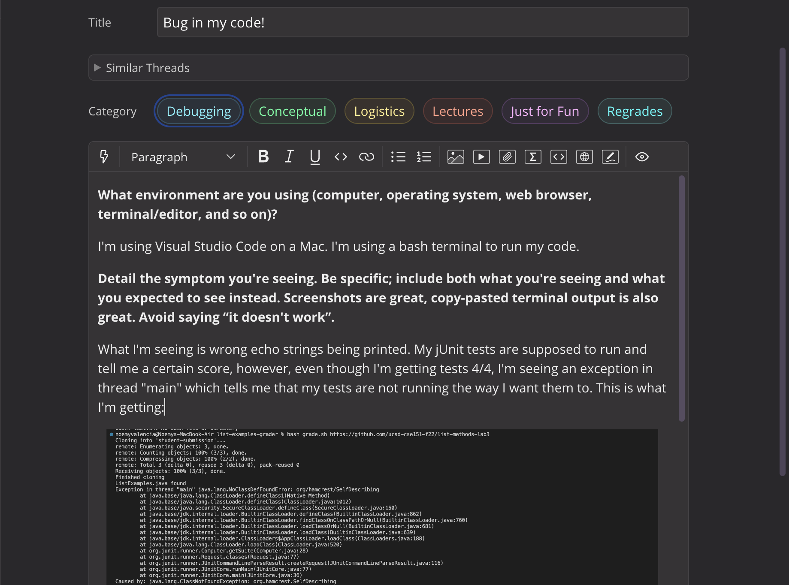
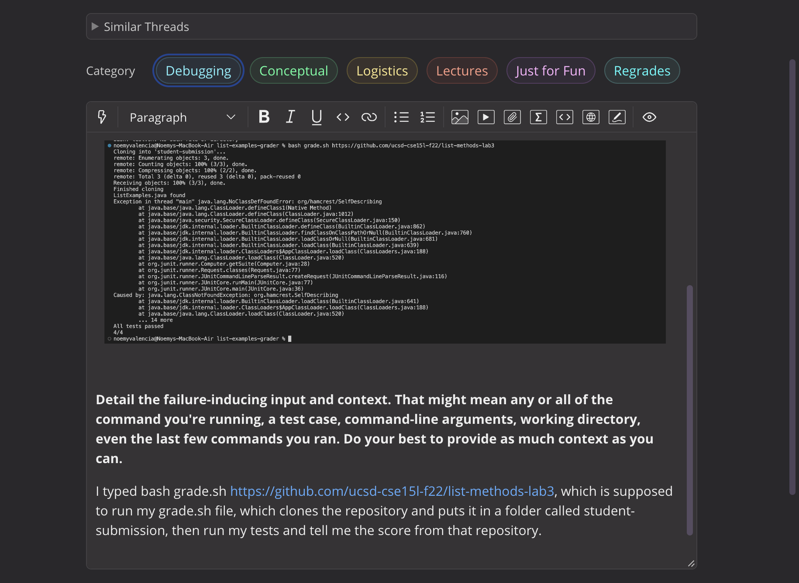
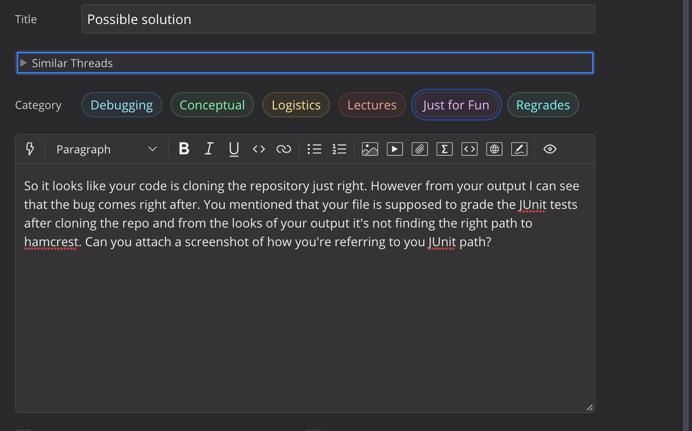
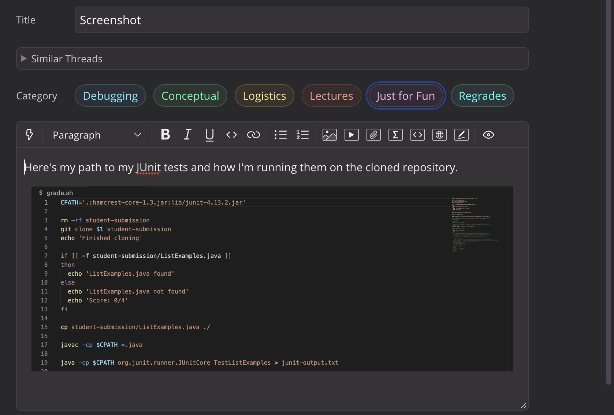
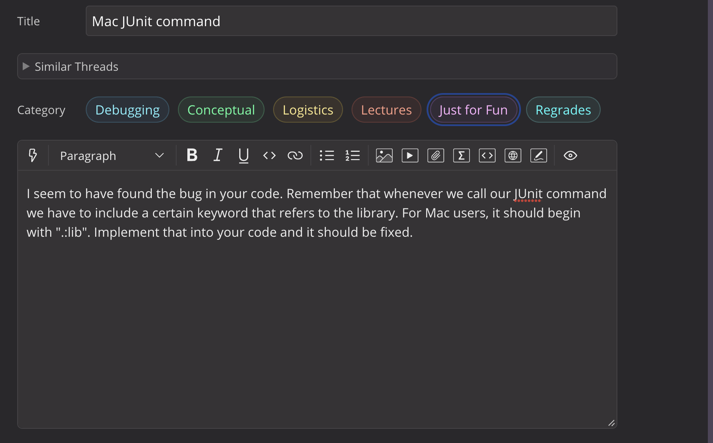

## Debugging 

# Part 1: EdStem Conversation.

# Student question: 

# 1: TA Response and thread: 

# 2: Fixed bug:

# 3: Information:
* What was needed was referring to the JUnit library correctly with the right bash command from grade.sh.
* This is what grade.sh looked like before fixing it.
* 
* I ran the bugged code with 'bash grade.sh https://github.com/ucsd-cse15l-f22/list-methods-lab3'
* The only thing to edit was the CPATH, which was not correctly referring to JUnit. Adding 'lib/' to the command fixes the bug.
---

# Part 2: Reflexion.
During the second half of the quarter I feel like I learned a lot of things that I didn't know about terminals and bash. Before this class I had only learned about Python and Java and the terminal was simply used to run methods. But it made me look realize how uselful it can be, I personally really like how we can edit through the terminal and I really liked vim too.

I think my favorite topic was vim, it was simple but very useful and I'm sure I'll be using it more in the future.
